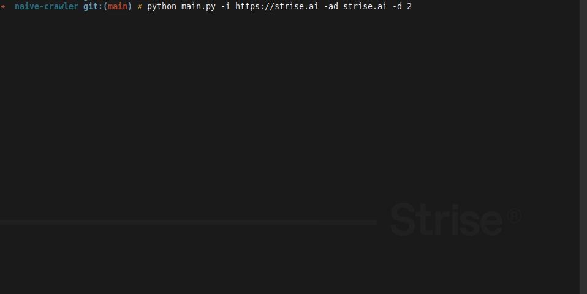

# 🕷️ CLI-based Web Crawler

<a href="url"></a>

## This miniscule project attempts to satisfy the following requirements:
1. The start URL should be configurable
2. It should be able to restrict the traversal by one or several domains
3. It should never visit the same site twice
4. The crawler should remember its state
5. It should be able to shut it off, and restart it at a later time, and continue where it left off

## Installation
```zsh
git clone https://github.com/wQuole/naive-crawler.git
```
> Clone the project

```zsh
cd naive-crawler
```
> Enter into the directory

```zsh
python -m venv venv
```
> Setup a virtual environment

```zsh
source venv/bin/activate
```
> Activate the virtual environment

```zsh
pip install -r requirements.txt
```
> Install the requirements


## Usage
```zsh
$ python main.py [-h] [--initial_url INITIAL_URL] [--allowed_domains ALLOWED_DOMAINS [ALLOWED_DOMAINS ...]] [--depth DEPTH]

optional arguments:
  -h, --help            show this help message and exit
  -i INITIAL_URL, --initial_url INITIAL_URL
                        Enter a start url (default: 'https://blog.scrapinghub.com')
  -ad ALLOWED_DOMAINS [ALLOWED_DOMAINS ...], --allowed_domains ALLOWED_DOMAINS [ALLOWED_DOMAINS ...]
                        Enter allowed domains (defualt: 'blog.scrapinghub.com')
  -d DEPTH, --depth DEPTH
                        Enter the depth, aka number of sites to crawl (default: 1)

```
### Examples
```zsh
$ python main.py
```
> Use default values

```zsh
$ python main.py -i https://strise.ai -ad strise.ai -d 2
```
> Start crawling from `https://strise.ai`, restrict the traversal of domains to `strise.ai` at `depth=2` 

## State
The state of the crawler can be saved using `pickle` or `JSON`. 
```YAML
{
  "current_url": "http://strise.ai/about-us/team",
  "visited_links": [
    "https://strise.ai",
    "http://strise.ai/about-us/team"
  ],
  "links_to_visit": [
    "http://strise.ai/about-us/stories",
    "http://strise.ai/about-us/our-vision",
    "http://strise.ai/post/monner",
    "http://strise.ai/",
    "http://strise.ai/product/sales-prospecting",
    "http://strise.ai/about-us/careers",
    "http://strise.ai/get-started",
    "http://strise.ai/product/risk",
    "http://strise.ai/post/folkeinvest-see-their-kyc-search-time-reduced-by-more-than-half-by-choosing-strise",
    "http://strise.ai/product/due-diligence",
    "http://strise.ai/post/kameo-chooses-strise-to-provide-a-platform-for-growth"
  ]
}
```
> State after running the 2nd example
## Future works
* Make it async 

